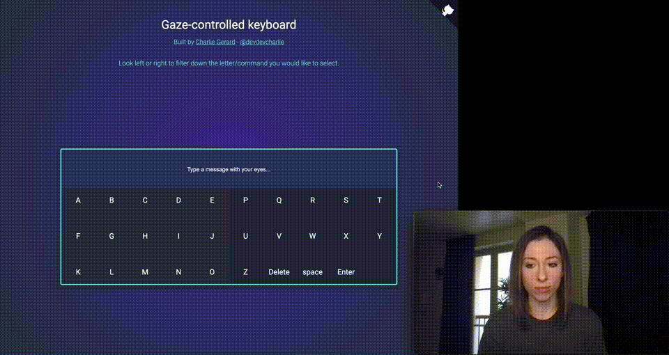

# Gaze-detection - Detect gaze direction in JavaScript using Tensorflow.js

Use machine learning in JavaScript to detect eye movements and build gaze-controlled experiences!

## Demo

Visit [https://gaze-keyboard.netlify.app/](https://gaze-keyboard.netlify.app/) (You can try it on mobile too!!)



Inspired by the Android application "Look to speak".

Uses Tensorflow.js's [face landmark detection model](https://www.npmjs.com/package/@tensorflow-models/face-landmarks-detection)

## Detection

This util detects when the user looks right, left, up and straight forward.

## How to use

### Install

As a npm module:

```bash
npm install gaze-detection --save
```

### Code sample

If used as a npm module, start by importing it:

```js
import gaze from "gaze-detection";
```

The module needs a webcam feed to run the detection:

```js
const videoElement = document.querySelector("video");

const init = async () => {
  // set up webcam feed
  await gaze.setInputVideo(videoElement);
};

init();
```

Once the video stream is set up, load the model:

```js
await gaze.loadModel();
```

Run the predictions:

```js
const predict = async () => {
  const gazePrediction = await gaze.getGazePrediction();
  console.log("Gaze direction: ", gazePrediction); //will return 'RIGHT', 'LEFT', 'STRAIGHT' or 'TOP'
  let raf = requestAnimationFrame(predict);
};
predict();
```
